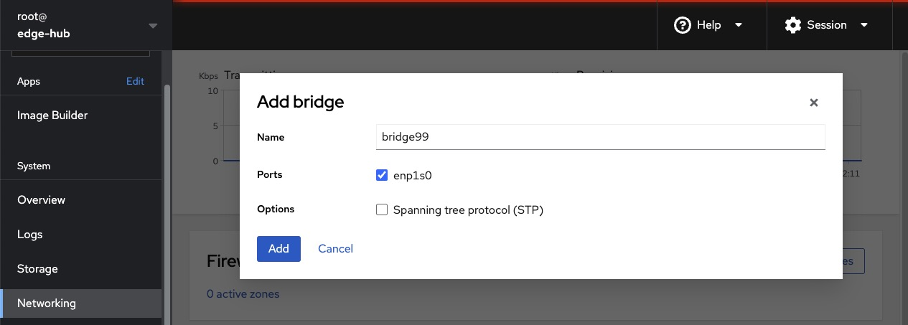

# Edge Hub Setup

It's assumed that for your edge devices you'll have a few different geo-local Edge Hubs - you don't want a system in California to be talking to a management endpoint in North Carolina after all.

In this example architecture there's an node called the Edge Hub - this provides the hosting of various services such as DNS, FDO, Image Building, PXE booting, VM host for Ansible, and the deployment of some other services with Podman.  This has been built/tested around the Edge Hub running RHEL 9 - 9.4 specifically.

There are a variety of Ansible Playbooks that can be used to configure the Edge Hub services, however some configuration is still unique to each person's environment and may need some manual work.  The below instructions will show how to execute these tasks.

---

## Install RHEL

This should be pretty easy enough - install RHEL 9.4.  Make sure you have a decent sized hard drive, 500GB at least - and get rid of the default `/home` partition that takes up most of the install and expand the `/` partition to the full disk.

Make sure to assign it a Static IP and Hostname - the examples as provided assume a subnet at `192.168.99.0/24`, Edge Hub IP of `192.168.99.10`, hostname of `edge-hub` on the `kemo.edge` Domain.

Go ahead and install and start the Cockpit Web UI - it's needed for Image Builder anyway and makes things a lot easier.  If you can't log into Cockpit via a root user, make sure to delete the line from `/etc/cockpit/disallowed-users`.

*Don't forget to subscribe the RHEL host.*

---

## Create a Bridge Network Interface

The use of Podman containers and VMs need a bridge network to provide interfaces and IPs from.  You can easily create the bridge interface from the Web UI.



> The following steps can be done via the Ansible Playbook `ansible/setup-edge-hub.yml`

---

## Install and Setup Podman

Next setup Podman:

```bash
# Install needed packages
dnf install -y podman udica buildah skopeo cockpit-podman podman-docker

# Make sure we have our networking directory
mkdir -p /etc/containers/networks

# Create a Podman bridge network
export BRIDGE_NAME="lanBridge"
export BRIDGE_SUBNET="192.168.99.0/24"
export BRIDGE_GATEWAY="192.168.99.1"
export BRIDGE_BASE_IFNAME="bridge99"

cat > /etc/containers/networks/${BRIDGE_NAME}.json << EOF
{
     "name": "${BRIDGE_NAME}",
     "driver": "bridge",
     "id": "$(tr -dc a-f0-9 </dev/urandom | head -c 64; echo)",
     "network_interface": "${BRIDGE_BASE_IFNAME}",
     "subnets": [
          {
               "subnet": "${BRIDGE_SUBNET}",
               "gateway": "${BRIDGE_GATEWAY}"
          }
     ],
     "ipv6_enabled": false,
     "internal": false,
     "dns_enabled": false,
     "ipam_options": {
          "driver": "host-local"
     }
}
EOF

# Enable and Start Podman
systemctl enable --now podman.socket
systemctl enable --now podman.service
```

> Now we can run the DNS and other services with Podman with a bridged interface for container dedicated IPs on this subnet.

---

## Setup Libvirt/KVM

There's the need for an AAP2 Controller - for that it's best to keep it in its own VM.  To do so, install Libvirt:

```bash
# Install needed packages
dnf install -y virt-install virt-viewer virt-top cockpit-machines libvirt libguestfs-tools

# Disable SELinux - I know, I know, whatever, this is a dev environment
# You can keep it enabled with these patches: https://github.com/kenmoini/homelab/blob/main/infrastructure/ansible/roles/kvm-host/tasks/selinux.yml
setenforce 0
cp /etc/sysconfig/selinux /etc/sysconfig/selinux.bak
cat /etc/sysconfig/selinux.bak | sed s/SELINUX=enforcing/SELINUX=disabled/g > /etc/sysconfig/selinux

# Enable unsafe interrupts
echo "options vfio_iommu_type1 allow_unsafe_interrupts=1" > /etc/modprobe.d/unsafe-interrupts.conf

# Create nf-bridge overrides
cat > /etc/sysctl.d/libvirt-nf-bridge.conf <<EOF
net.bridge.bridge-nf-call-ip6tables=0
net.bridge.bridge-nf-call-iptables=0
net.bridge.bridge-nf-call-arptables=0
EOF

# Create udev rules
echo 'ACTION=="add", SUBSYSTEM=="module", KERNEL=="br_netfilter", RUN+="/sbin/sysctl -p /etc/sysctl.d/libvirt-nf-bridge.conf"' > /etc/udev/rules.d/99-bridge.rules

# Enable and start Libvirt
systemctl enable --now libvirtd

# Delete the default VM network
virsh net-destroy default
virsh net-undefine default

# Create a bridge network
cat > bridge.xml <<EOF
<network>
  <name>bridge99</name>
  <bridge name="bridge99"/>
  <forward mode="bridge"/>
</network>
EOF

# Create/start the Libvirt network
virsh net-define bridge.xml
virsh net-start bridge99
virsh net-autostart bridge99
```

> Now you can create VMs on this host - make sure to download a RHEL 9 ISO to the host for the installation of an Ansible Controller VM.

---

## Next Steps

The next steps to configure the Edge Hub would be:

- Setup DNS with the instructions in `dns-setup.md` or the `ansible/setup-dns.yml` Playbook.

Once DNS is setup, or if you're using an external DNS service, you can continue without.  Then you can:

- Install AAP2 Controller in a VM
- Configure AAP2 with the `ansible/controller-setup/configure-controller.yml` Playbook.

From there you can perform the rest of the configuration from the AAP2 Controller with the created Jobs:

- Setup Image Builder
- Setup FDO Server
- Deploy Microservices

Or you can run the Playbooks locally/manually:

- Setup Image Builder with the `ansible/setup-image-builder-server.yml` Playbook
- Setup FDO Server with the `ansible/setup-fdo-server.yml` Playbook
- Deploy Microservices with the `ansible/deploy-microservices.yml` Playbook

With that complete, you can start running the RHDE workflows.